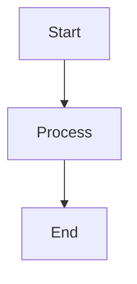

# emma-docs

A Node.js utility for converting Markdown files to HTML and PDF with full support for Mermaid diagrams.

## Features

- **Markdown to HTML** - Clean, responsive HTML output with modern styling
- **Markdown to PDF** - A4 PDF generation via Puppeteer
- **Mermaid Diagrams** - Full support for flowcharts, sequence diagrams, and more
- **GitHub-Flavored Markdown** - Tables, code blocks, and extended syntax

## Installation

```bash
npm install
```

## Usage

### Convert to HTML only

```bash
npm run convert:html [input.md] [output.html]
```

### Convert to PDF only

```bash
npm run convert:pdf [input.md] [output.pdf]
```

### Convert to both HTML and PDF

```bash
npm run convert:both [input.md]
```

### Examples

```bash
# Convert default file (CODE_SUMMARY.md)
npm run convert:both

# Convert a specific file
npm run convert:html docs/my-document.md

# Convert with custom output path
npm run convert:pdf docs/my-document.md output/document.pdf
```

## Default Behavior

If no input file is specified, the tool converts `CODE_SUMMARY.md` in the current directory.

Output files are named based on the input file:
- `input.md` → `input.html` and/or `input.pdf`

## Mermaid Diagram Support

The converter automatically renders Mermaid diagrams. Use standard Mermaid code blocks:

````markdown

````

Supported diagram types:
- Flowcharts
- Sequence diagrams
- Class diagrams
- State diagrams
- Gantt charts
- And more...

## Dependencies

| Package | Purpose |
|---------|---------|
| `marked` | Markdown parsing |
| `puppeteer` | PDF generation and Mermaid rendering |

## Output Styling

The HTML output includes:
- Responsive layout (max-width: 1200px)
- Clean typography with system fonts
- Styled code blocks with syntax highlighting background
- Formatted tables with alternating row colors
- Styled blockquotes

## License

MIT
