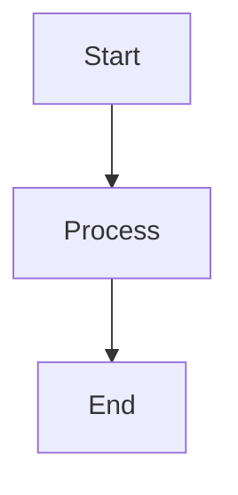

# convert-md

A Node.js utility for converting Markdown files to HTML and PDF with full support for Mermaid diagrams.

## Features

- **Markdown to HTML** - Clean, responsive HTML output with modern styling
- **Markdown to PDF** - A4 PDF generation via Puppeteer
- **Mermaid Diagrams** - Full support for flowcharts, sequence diagrams, and more
- **GitHub-Flavored Markdown** - Tables, code blocks, and extended syntax

## Installation

```bash
npm install
# or
bin/convert-md --init
```

## Usage

### Command Line Tool (recommended)

The `convert-md` script in `bin/` can be run from anywhere:

```bash
# Add to your PATH (optional, add to ~/.zshrc or ~/.bashrc)
export PATH="/path/to/node-tools/bin:$PATH"

# Or run directly
/path/to/node-tools/bin/convert-md html README.md
```

```bash
convert-md html README.md              # Convert to HTML
convert-md pdf README.md               # Convert to PDF
convert-md both README.md              # Convert to both
convert-md html doc.md output.html     # Specify output path
convert-md --init                      # Install dependencies
convert-md --help                      # Show help
```

### npm scripts

```bash
npm run convert:html [input.md] [output.html]
npm run convert:pdf [input.md] [output.pdf]
npm run convert:both [input.md]
```

### Makefile

```bash
make html file=README.md
make pdf file=README.md
make both file=README.md
```

### Examples

```bash
# Convert default file (CODE_SUMMARY.md)
npm run convert:both

# Convert a specific file
convert-md html docs/my-document.md

# Convert with custom output path
convert-md pdf docs/guide.md output/guide.pdf
```

## Default Behavior

If no input file is specified, the tool converts `CODE_SUMMARY.md` in the current directory.

Output files are named based on the input file:
- `input.md` → `input.html` and/or `input.pdf`

## Mermaid Diagram Support

The converter automatically renders Mermaid diagrams. Use standard Mermaid code blocks:

````markdown

````

Supported diagram types:
- Flowcharts
- Sequence diagrams
- Class diagrams
- State diagrams
- Gantt charts
- And more...

## Dependencies

| Package | Purpose |
|---------|---------|
| `marked` | Markdown parsing |
| `puppeteer` | PDF generation and Mermaid rendering |

## Output Styling

The HTML output includes:
- Responsive layout (max-width: 1200px)
- Clean typography with system fonts
- Styled code blocks with syntax highlighting background
- Formatted tables with alternating row colors
- Styled blockquotes

## License

MIT
