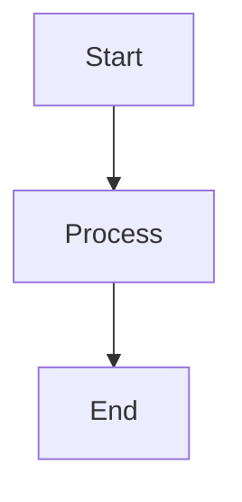

# Sample Document

This is a **sample** markdown document for testing.

## Features

- Item 1
- Item 2
- Item 3

## Code Block

```javascript
const hello = 'world';
console.log(hello);
```

## Mermaid Diagram



## Table

| Name | Value |
|------|-------|
| Foo  | 1     |
| Bar  | 2     |

## Blockquote

> This is a blockquote
> with multiple lines.

## Links

Visit [Example](https://example.com) for more info.
